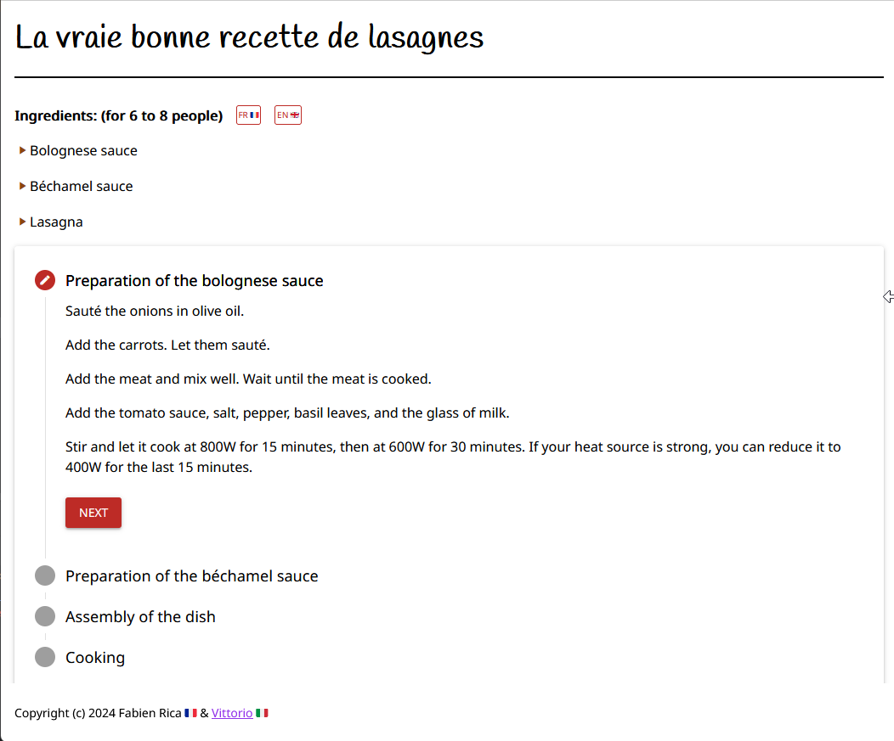

# Lasagnapp

A tribute to an italian friend of mine, a damn good cook who taught how to make proper lasagnas last year.

Available in French and English (translation made by ChatGPT).

The project itself was a styling playground with NiceGUI and the opportunity to discover the Python internationalization framework `gettext`.

## Screenshot

  

## Uses

* NiceGUI

## Inspiration

* [Vittorio](https://www.vittorio.gent/)